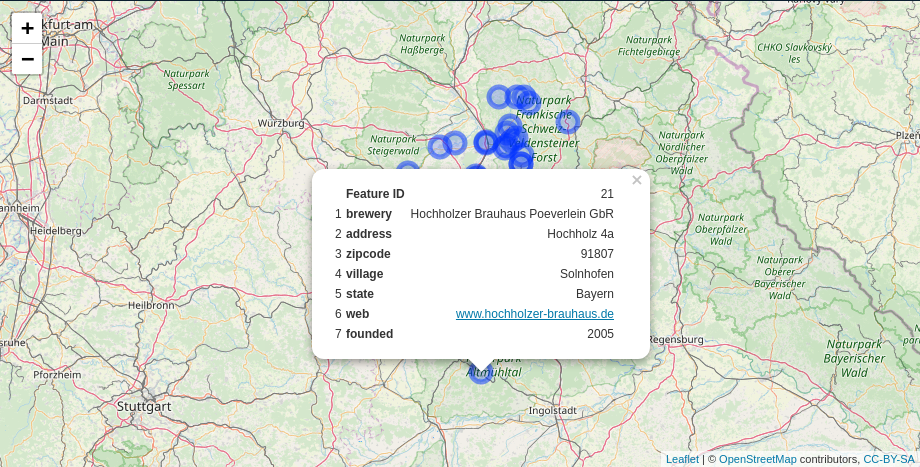
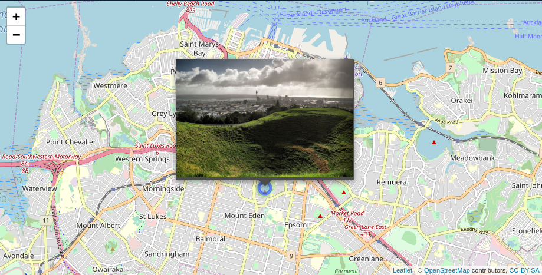
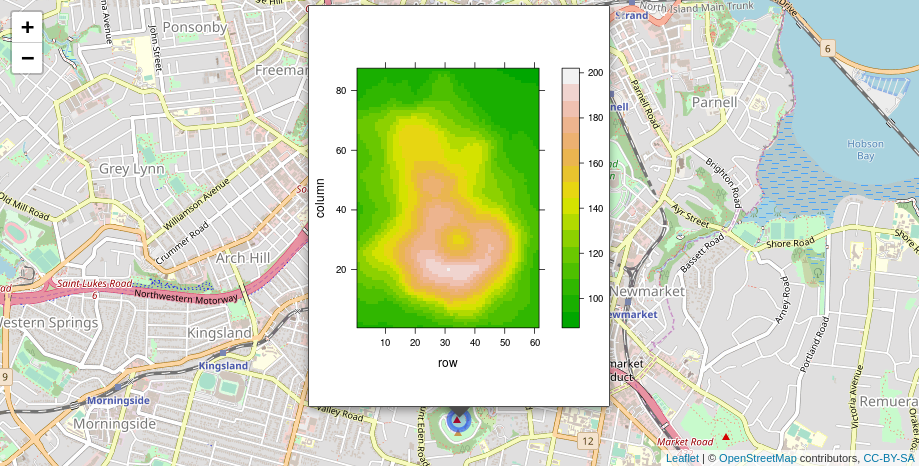

<!-- README.md is generated from README.Rmd. Please edit that file -->

# Include Tables, Images and Graphs in Leaflet Popups

[](https://cran.r-project.org/web/checks/check_results_leafpop.html)
[](https://travis-ci.org/r-spatial/leafpop)
[](https://www.rpackages.io/package/leafpop)
[](https://www.rpackages.io/package/leafpop)
[](https://cran.r-project.org/package=leafpop)
[](https://CRAN.R-project.org/package=leafpop)

`leafpop` creates HTML strings to embed tables, images or graphs in
popups of interactive maps created with packages ‘leaflet’ or ‘mapview’.
Handles local paths to images on the file system or remote urls. Handles
graphs created with ‘base’ graphics, ‘lattice’ or ‘ggplot2’ as well as
interactive plots created with ‘htmlwidgets’.

## Installation

You can install the released version of `leafpop` from
[CRAN](https://CRAN.R-project.org) with:

``` r
install.packages("leafpop")
```

Or the development version from GitHub:

``` r
# install.packages("devtools")
devtools::install_github("r-spatial/leafpop")
```

## Examples

#### popupTable

``` r
library(leaflet)

leaflet() %>%
  addTiles() %>%
  addCircleMarkers(data = breweries91,
                   popup = popupTable(breweries91))
```



#### addPopupImages & popupImage

``` r
library(sf)
library(leaflet)

pnt = st_as_sf(data.frame(x = 174.764474, y = -36.877245),
                coords = c("x", "y"),
                crs = 4326)

img = "http://bit.ly/1TVwRiR"

leaflet() %>%
  addTiles() %>%
  addCircleMarkers(data = pnt, group = "pnt") %>%
  addPopupImages(img, group = "pnt")
```



Alternatively you can bind the images directly in in the `add*` call,
however, this will not include the images when the map is saved using
`mapshot` or `saveWidget`. This options is basically available for
backward compatibility only.

``` r

leaflet() %>%
  addTiles() %>%
  addCircleMarkers(data = pnt, popup = popupImage(img, src = "remote"))
```

#### popupGraph

``` r
library(sf)
library(leaflet)
library(lattice)

pnt = st_as_sf(data.frame(x = 174.764474, y = -36.877245),
                coords = c("x", "y"),
                crs = 4326)

p2 = levelplot(t(volcano), col.regions = terrain.colors(100))

leaflet() %>%
  addTiles() %>%
  addCircleMarkers(data = pnt, group = "pnt") %>%
  addPopupGraphs(list(p2), group = "pnt", width = 300, height = 400)
```



Alternatively you can bind the graphs directly in in the `add*` call,
however, this will not include the graphs when the map is saved using
`mapshot` or `saveWidget`. This options is basically available for
backward compatibility only.

``` r

leaflet() %>%
  addTiles() %>%
  addCircleMarkers(data = pnt, popup = popupGraph(p2, width = 300, height = 400))
```

#### Further examples

See the [mapview
documentation](https://r-spatial.github.io/mapview/articles/articles/mapview_04-popups.html)
for further examples.

### Code of Conduct

Please note that the ‘leafpop’ project is released with a [Contributor
Code of
Conduct](https://github.com/r-spatial/leafpop/blob/master/CODE_OF_CONDUCT.md).
By participating in this project you agree to abide by its terms.
